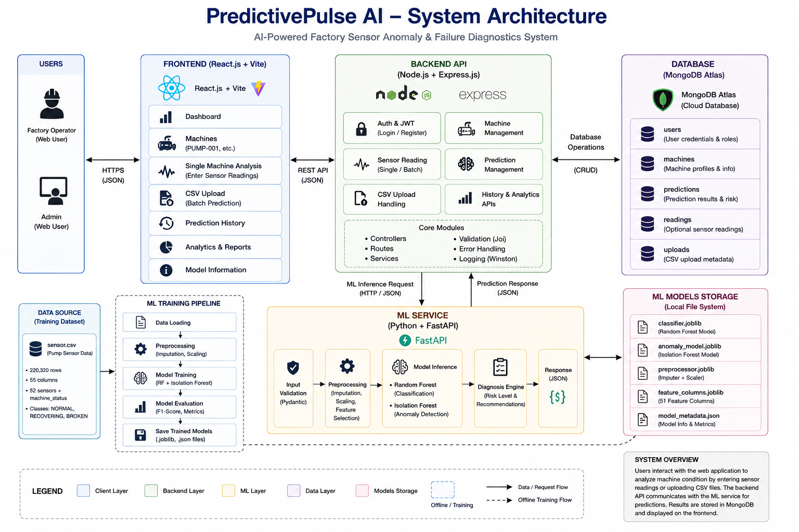
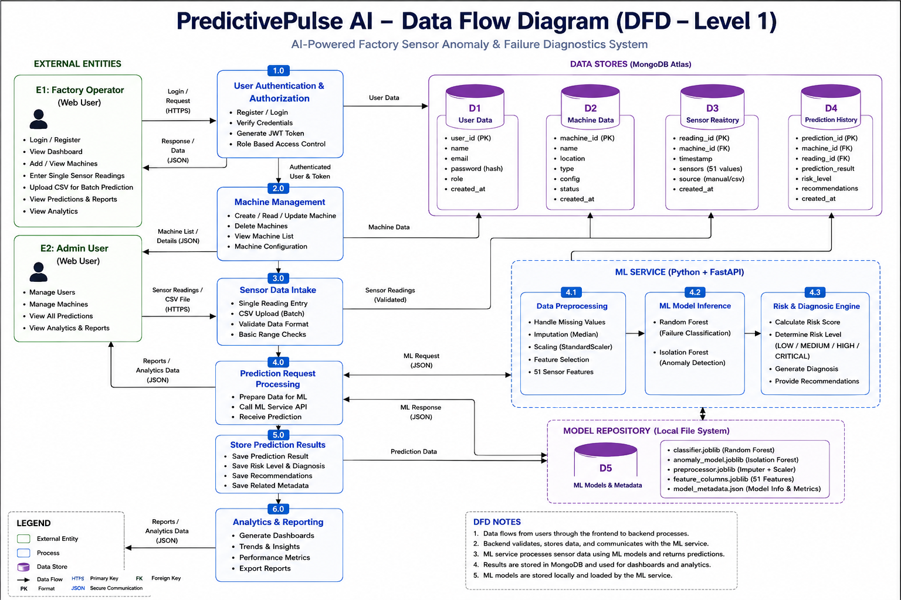
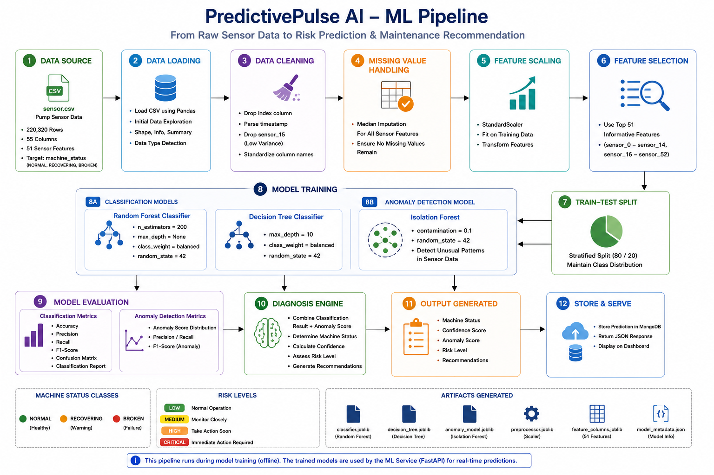
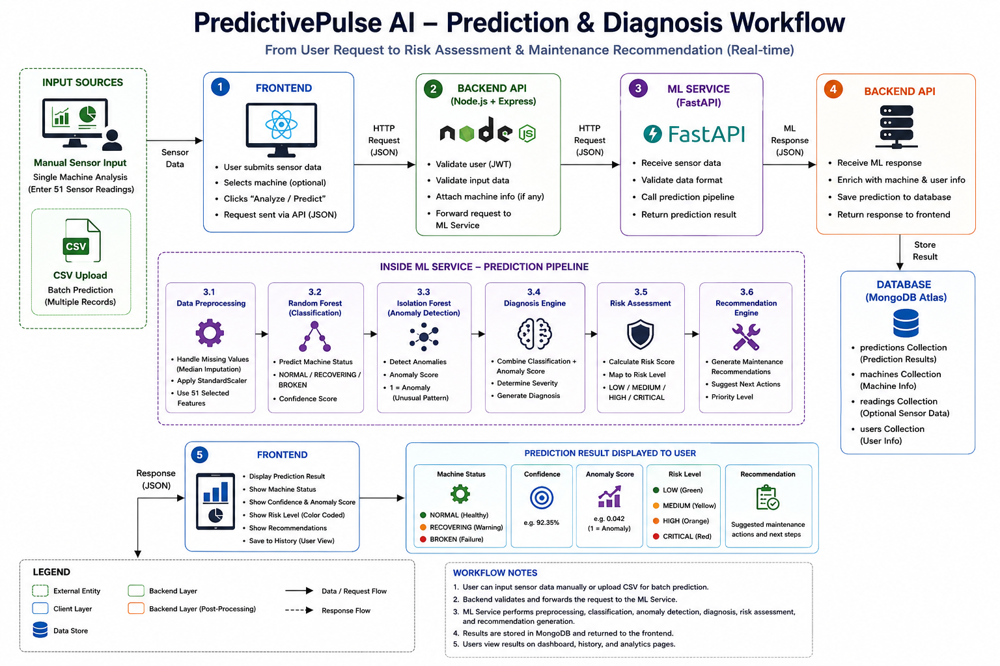

Yes. Below is the **final GitHub-ready README** based on all the requirements we established:

* Professional appearance similar to your MediStream example
* Centered title and subtitle
* Live Demo / GitHub / Documentation buttons
* Technology badges
* Table of Contents
* **Only your 4 actual diagrams** from `docs/`
* **No ASCII diagrams**
* **No 11 screenshots displayed inside README**
* Screenshots remain available through the `screenshots/` folder
* Complete project explanation
* Dataset and ML details
* Model evaluation
* Architecture and DFD
* Installation
* Deployment
* API
* Limitations
* Future scope
* Author section

### Before pasting

You only need to replace these two placeholders everywhere they occur:

```text
YOUR_LIVE_DEMO_URL
YOUR_GITHUB_REPOSITORY_URL
```

with your actual deployed application URL and GitHub repository URL.

````markdown
<div align="center">

# 🚀 PredictivePulse AI

### AI-Powered Factory Sensor Anomaly Detection & Failure Diagnostics System

**Smart Sensor Analysis • Failure Classification • Anomaly Detection • Risk Assessment • Predictive Maintenance**

<p>
  <a href="YOUR_LIVE_DEMO_URL">
    <strong>🌐 LIVE DEMO</strong>
  </a>
  &nbsp;&nbsp;•&nbsp;&nbsp;
  <a href="YOUR_GITHUB_REPOSITORY_URL">
    <strong>💻 GITHUB REPOSITORY</strong>
  </a>
  &nbsp;&nbsp;•&nbsp;&nbsp;
  <a href="YOUR_LIVE_DEMO_URL">
    <strong>🚀 DEPLOYED APPLICATION</strong>
  </a>
</p>

<p>
  <strong>React</strong> •
  <strong>Vite</strong> •
  <strong>Node.js</strong> •
  <strong>Express.js</strong> •
  <strong>Python</strong> •
  <strong>FastAPI</strong> •
  <strong>scikit-learn</strong> •
  <strong>MongoDB Atlas</strong> •
  <strong>Docker</strong>
</p>

</div>

---

# 📌 Table of Contents

- [🌟 About the Project](#-about-the-project)
- [🎯 Problem Statement](#-problem-statement)
- [💡 Proposed Solution](#-proposed-solution)
- [🎯 Objectives](#-objectives)
- [✨ Key Features](#-key-features)
- [🏗️ System Architecture](#️-system-architecture)
- [🔄 Data Flow Diagram](#-data-flow-diagram)
- [🤖 Machine Learning Pipeline](#-machine-learning-pipeline)
- [🔍 Prediction & Diagnosis Workflow](#-prediction--diagnosis-workflow)
- [📊 Dataset](#-dataset)
- [🧹 Data Preprocessing](#-data-preprocessing)
- [🧠 Machine Learning Models](#-machine-learning-models)
- [📈 Model Evaluation](#-model-evaluation)
- [⚠️ Important ML Limitation](#️-important-ml-limitation)
- [🧠 Diagnosis & Risk Assessment](#-diagnosis--risk-assessment)
- [🗄️ Database Design](#️-database-design)
- [🛠️ Technology Stack](#️-technology-stack)
- [📁 Project Structure](#-project-structure)
- [🖥️ Application Screenshots](#️-application-screenshots)
- [🔌 API Overview](#-api-overview)
- [⚙️ Local Installation](#️-local-installation)
- [🔐 Environment Configuration](#-environment-configuration)
- [🐳 Docker Deployment](#-docker-deployment)
- [🌐 Live Deployment](#-live-deployment)
- [🧪 Testing](#-testing)
- [📚 Documentation](#-documentation)
- [⚠️ Limitations](#️-limitations)
- [🚀 Future Scope](#-future-scope)
- [🔒 Security](#-security)
- [📦 ML Model Artifacts](#-ml-model-artifacts)
- [🔬 ML Training](#-ml-training)
- [🎓 Academic Project](#-academic-project)
- [👨‍💻 Author](#-author)
- [🔗 Project Links](#-project-links)

---

# 🌟 About the Project

**PredictivePulse AI** is a full-stack **AI/ML predictive maintenance platform** designed to analyze factory machine sensor data, identify known machine operating conditions, detect abnormal sensor patterns, and generate actionable machine-health assessments.

The platform integrates:

- Supervised machine-status classification
- Unsupervised anomaly detection
- Sensor-data preprocessing
- Machine diagnosis
- Risk assessment
- Maintenance recommendations
- Machine management
- Manual sensor analysis
- CSV batch prediction
- Prediction history
- Analytics
- ML model information
- REST API integration
- MongoDB-based data storage

The system uses **Random Forest** as the primary classification model and **Isolation Forest** for anomaly detection. Their outputs are combined through an application-level diagnosis and risk-assessment engine.

> **Project Scope:** PredictivePulse AI is an academic/research/internship prototype for predictive maintenance. It is not a certified industrial safety or machine-control system and should not replace professional industrial safety procedures.

---

# 🎯 Problem Statement

Industrial machines continuously generate large volumes of sensor data. Changes in sensor patterns may indicate abnormal operating conditions or potential machine problems.

Traditional monitoring approaches may depend heavily on:

- Manual inspection
- Fixed thresholds
- Individual sensor monitoring
- Reactive maintenance

These approaches may not effectively identify complex patterns across multiple sensor readings.

PredictivePulse AI addresses this problem by providing an integrated platform capable of:

- Processing multiple sensor readings
- Classifying known machine conditions
- Detecting unusual sensor patterns
- Combining classification and anomaly signals
- Estimating machine-health risk
- Providing maintenance recommendations
- Maintaining prediction history
- Presenting results through an interactive dashboard

---

# 💡 Proposed Solution

PredictivePulse AI provides a complete machine-health analysis workflow.

Users can:

- Register and log in
- Manage machines
- Enter individual sensor readings
- Upload sensor CSV files
- Analyze machine conditions
- View prediction results
- View historical predictions
- Analyze machine-health trends
- View ML model information

Sensor data is validated and processed by the Node.js/Express backend and forwarded to the Python/FastAPI ML service.

The ML service performs preprocessing, classification, anomaly detection, diagnosis, and risk assessment.

The final result is returned to the backend, stored in MongoDB Atlas, and presented through the React frontend.

---

# 🎯 Objectives

The major objectives of PredictivePulse AI are:

- Detect known machine operating conditions using machine learning.
- Identify unusual sensor patterns using anomaly detection.
- Handle highly imbalanced sensor datasets.
- Provide classification confidence.
- Combine supervised and unsupervised ML outputs.
- Generate understandable risk levels.
- Provide maintenance recommendations.
- Support manual sensor analysis.
- Support CSV-based batch analysis.
- Maintain prediction history.
- Provide machine-level analytics.
- Provide ML model information.
- Integrate an ML pipeline into a complete full-stack application.
- Provide a scalable architecture separating frontend, backend, database, and ML services.

---

# ✨ Key Features

## 🔐 Authentication & Authorization

- User registration
- User login
- JWT-based authentication
- Password hashing using bcrypt
- Protected routes
- User information
- Role-based access support

## 🏭 Machine Management

- Add machines
- View machine list
- Update machine information
- View machine details
- Track machine status
- Track machine risk
- Track last analysis
- Manage machine configuration

## 📊 Sensor Analysis

- Manual sensor input
- Sensor-data validation
- CSV sensor-data upload
- Batch prediction
- Sensor history
- Dataset sample loading
- 51 usable sensor features

## 🤖 Machine Learning

- Random Forest classification
- Decision Tree comparison
- Isolation Forest anomaly detection
- Median missing-value imputation
- StandardScaler preprocessing
- Feature selection
- Model evaluation
- Model metadata
- Serialized model artifacts

## 🧠 Diagnosis Engine

The diagnosis engine combines:

- Predicted machine status
- Classification confidence
- Anomaly result
- Anomaly score

to generate an application-level machine-health assessment.

## 🚨 Risk Assessment

The application supports four risk levels:

- LOW
- MEDIUM
- HIGH
- CRITICAL

## 📈 Analytics

- Prediction statistics
- Machine-status statistics
- Risk distribution
- Historical prediction analysis
- Charts
- Model-performance information

## 📁 CSV Batch Prediction

Users can upload sensor CSV data and process multiple records through the ML service.

## 📜 Prediction History

Prediction records can contain:

- Machine
- Sensor data
- Predicted status
- Classification confidence
- Anomaly status
- Anomaly score
- Risk level
- Machine status
- Recommendation
- Source
- Timestamp
- User

---

# 🏗️ System Architecture

PredictivePulse AI follows a layered architecture consisting of a React frontend, Node.js/Express backend, MongoDB Atlas database, and Python/FastAPI machine-learning service.



The architecture separates the major responsibilities of the system:

- **Frontend:** User interface and visualization
- **Backend:** Authentication, machine management, API handling and database operations
- **ML Service:** Data preprocessing, model inference, anomaly detection and diagnosis
- **MongoDB Atlas:** Application data and prediction storage
- **Model Repository:** Trained ML model artifacts

---

# 🔄 Data Flow Diagram

The Level 1 Data Flow Diagram describes how information moves between external users, application processes, data stores, and the ML service.



The DFD represents the major processes including:

- User authentication
- Machine management
- Sensor data intake
- Prediction request processing
- ML preprocessing
- ML inference
- Risk and diagnosis processing
- Prediction storage
- Analytics and reporting

---

# 🤖 Machine Learning Pipeline

The machine-learning pipeline processes the supplied sensor dataset and produces reusable model artifacts.



The pipeline includes:

- Data loading
- Data cleaning
- Missing-value handling
- Feature preprocessing
- Feature scaling
- Feature selection
- Classification model training
- Model evaluation
- Random Forest model selection
- Isolation Forest training
- Model serialization
- Metadata generation

---

# 🔍 Prediction & Diagnosis Workflow

The prediction and diagnosis workflow illustrates the complete inference process from sensor input to the final machine-health assessment.



The system combines supervised classification and unsupervised anomaly detection before generating the final diagnosis and risk assessment.

---

# 📊 Dataset

The project uses the supplied factory pump sensor dataset:

```text
ml-service/data/sensor.csv
````

## Dataset Information

| Property               |                    Value |
| ---------------------- | -----------------------: |
| Rows                   |                  220,320 |
| Columns                |                       55 |
| Usable sensor features |                       51 |
| Target                 |         `machine_status` |
| Time range             | 2018-04-01 to 2018-08-31 |
| Duplicate rows         |                        0 |
| Dropped feature        |              `sensor_15` |

## Machine Status Distribution

| Class      |   Count | Approx. Percentage |
| ---------- | ------: | -----------------: |
| NORMAL     | 205,836 |              93.4% |
| RECOVERING |  14,477 |               6.6% |
| BROKEN     |       7 |             0.003% |

### Dataset Characteristics

The dataset is highly imbalanced.

The `NORMAL` class represents the overwhelming majority of observations, while the `BROKEN` class contains only a very small number of samples.

This imbalance is an important consideration when interpreting model performance.

---

# 🧹 Data Preprocessing

The preprocessing workflow includes:

* Dataset loading
* Timestamp parsing
* Removal of the `Unnamed: 0` index artifact
* Removal of `sensor_15`
* Missing-value handling
* Median imputation
* Feature scaling using `StandardScaler`
* Feature selection
* Stratified train/test splitting
* Reuse of the fitted preprocessing pipeline during inference

## Missing Feature Handling

The supplied dataset contains:

```text
sensor_15 → 100% missing
```

Therefore, `sensor_15` is removed during preprocessing.

The resulting model input contains **51 usable sensor features**.

The same saved preprocessing pipeline is used during inference to maintain consistency between training and prediction.

---

# 🧠 Machine Learning Models

## 🌲 Random Forest

Random Forest is the primary production classification model.

Configuration:

| Parameter              |    Value |
| ---------------------- | -------: |
| Number of estimators   |      200 |
| Maximum depth          |       16 |
| Class weighting        | Balanced |
| Model selection metric | Macro F1 |

Random Forest was selected using macro F1 because the dataset is highly imbalanced.

---

## 🌳 Decision Tree

Decision Tree is used as a comparison classification model.

Configuration:

| Parameter       |    Value |
| --------------- | -------: |
| Maximum depth   |       12 |
| Class weighting | Balanced |

---

## 🔎 Isolation Forest

Isolation Forest is used for unsupervised anomaly detection.

Configuration:

| Parameter            |                         Value |
| -------------------- | ----------------------------: |
| Number of estimators |                           200 |
| Contamination        |                          0.02 |
| Training data        | NORMAL-labelled training rows |

Isolation Forest identifies unusual sensor patterns independently of the supervised classification result.

---

# 📈 Model Evaluation

The latest training run produced the following results:

| Model             |   Accuracy |  Macro F1 |
| ----------------- | ---------: | --------: |
| Decision Tree     |     99.92% |     0.665 |
| **Random Forest** | **99.98%** | **0.666** |

Random Forest was selected as the production classifier because it achieved the higher macro F1 score.

## Random Forest Per-Class Performance

| Class      | Precision | Recall |     F1 | Support |
| ---------- | --------: | -----: | -----: | ------: |
| NORMAL     |    0.9999 | 0.9999 | 0.9999 |  41,167 |
| RECOVERING |    0.9990 | 0.9990 | 0.9990 |   2,895 |
| BROKEN     |    0.0000 | 0.0000 | 0.0000 |       2 |

---

# ⚠️ Important ML Limitation

The `BROKEN` class contains only **7 examples in the complete dataset**.

Only **2 BROKEN examples** occur in the test set, and the latest Random Forest model did not correctly classify either of them.

Therefore:

> The 99.98% overall accuracy must **not** be interpreted as reliable machine-failure detection performance.

The project reports:

* Precision
* Recall
* F1-score
* Macro F1
* Class support

rather than relying only on overall accuracy.

This provides a more transparent evaluation of the highly imbalanced dataset.

---

# 🔎 Isolation Forest Results

The latest test-set anomaly rates were:

| True Class | Flagged as Anomalous |
| ---------- | -------------------: |
| NORMAL     |                1.98% |
| RECOVERING |                69.7% |
| BROKEN     |                50.0% |

Isolation Forest identifies unusual sensor patterns but does not determine the physical cause of an anomaly.

---

# 🧠 Diagnosis & Risk Assessment

PredictivePulse AI combines the classification and anomaly-detection outputs through a deterministic diagnosis engine.

## Risk Levels

| Risk Level  | General Interpretation                            | Recommendation                                        |
| ----------- | ------------------------------------------------- | ----------------------------------------------------- |
| 🟢 LOW      | Normal operating condition                        | Continue normal monitoring                            |
| 🟡 MEDIUM   | Lower-confidence or potentially unusual condition | Inspect sensor trends                                 |
| 🟠 HIGH     | Elevated machine-health concern                   | Schedule maintenance promptly                         |
| 🔴 CRITICAL | Severe or highly concerning condition             | Follow immediate factory inspection/safety procedures |

The risk assessment is an **application-level ML signal** and is not a certified industrial safety score.

---

# 🗄️ Database Design

PredictivePulse AI uses **MongoDB Atlas** with **Mongoose**.

## Main Data Models

| Model        | Purpose                                      |
| ------------ | -------------------------------------------- |
| User         | User accounts, credentials and roles         |
| Machine      | Machine profiles and status                  |
| SensorRecord | Sensor readings                              |
| Prediction   | Prediction results and diagnosis information |

## User Data

Stores information such as:

* Name
* Email
* Password hash
* Role

## Machine Data

Stores:

* Machine ID
* Name
* Type
* Location
* Status
* Current risk
* Last analysis time

## Sensor Data

Stores:

* Machine ID
* Timestamp
* Sensor values

## Prediction Data

Stores relevant information such as:

* Machine ID
* Sensor values
* Predicted status
* Classification confidence
* Anomaly result
* Anomaly score
* Risk level
* Machine status
* Recommendation
* Source
* Timestamp
* User ID

---

# 🛠️ Technology Stack

## Frontend

* React
* Vite
* React Router
* Axios
* Recharts
* Tailwind CSS

## Backend

* Node.js
* Express.js
* Mongoose
* JWT
* bcryptjs
* Multer
* Axios

## Machine Learning

* Python
* FastAPI
* Uvicorn
* pandas
* NumPy
* scikit-learn
* joblib
* matplotlib
* seaborn

## Database

* MongoDB
* MongoDB Atlas

## Development & Deployment

* Git
* GitHub
* VS Code
* Docker
* Docker Compose

---

# 📁 Project Structure

```text
PredictivePulse-AI/
│
├── frontend/
│
├── backend/
│
├── ml-service/
│   ├── data/
│   │   └── sensor.csv
│   ├── models/
│   │   ├── classifier.joblib
│   │   ├── anomaly_model.joblib
│   │   ├── preprocessor.joblib
│   │   ├── feature_columns.joblib
│   │   └── model_metadata.json
│   ├── preprocessing/
│   ├── services/
│   ├── schemas/
│   ├── training/
│   ├── reports/
│   ├── tests_ml.py
│   ├── app.py
│   └── requirements.txt
│
├── docs/
│   ├── system-architecture.png
│   ├── dfd-level-1.png
│   ├── ml-pipeline.png
│   ├── prediction-diagnosis-workflow.png
│   ├── api-documentation.md
│   ├── database-design.md
│   ├── ml-methodology.md
│   ├── project-overview.md
│   ├── system-architecture.md
│   ├── testing.md
│   └── limitations.md
│
├── screenshots/
│   ├── 01-login.png
│   ├── 02-registration.png
│   ├── 03-dashboard.png
│   ├── 04-machines.png
│   ├── 05-machine-details.png
│   ├── 06-single-analysis.png
│   ├── 07-csv-upload.png
│   ├── 08-prediction-result.png
│   ├── 09-prediction-history.png
│   ├── 10-analytics.png
│   └── 11-model-information.png
│
├── docker-compose.yml
├── setup.bat
├── start.bat
├── .gitignore
└── README.md
```

---

# 🖥️ Application Screenshots

The README intentionally does not embed all application screenshots in order to keep the documentation concise and professional.

The complete collection of application screenshots is available in the repository:

**[📸 Open Application Screenshots](screenshots/)**

The screenshot collection includes:

* Login
* Registration
* Dashboard
* Machine Management
* Machine Details
* Single Machine Analysis
* CSV Upload
* Prediction Result
* Prediction History
* Analytics
* Model Information

---

# 🔌 API Overview

## FastAPI ML Service

The FastAPI service provides the machine-learning inference layer.

### Development URL

```text
http://localhost:8000
```

### Swagger Documentation

```text
http://localhost:8000/docs
```

### Main Endpoints

| Method | Endpoint       | Purpose                           |
| ------ | -------------- | --------------------------------- |
| GET    | `/health`      | ML service health                 |
| POST   | `/predict`     | Classification prediction         |
| POST   | `/anomaly`     | Anomaly detection                 |
| POST   | `/analyze`     | Combined prediction and diagnosis |
| POST   | `/predict-csv` | Batch CSV inference               |
| GET    | `/model-info`  | Model information                 |
| GET    | `/sample`      | Dataset sample                    |

---

## Node.js Backend

### Development URL

```text
http://localhost:5000
```

### Main Endpoints

| Method   | Endpoint                           | Purpose                    |
| -------- | ---------------------------------- | -------------------------- |
| POST     | `/api/auth/register`               | Create account             |
| POST     | `/api/auth/login`                  | Login                      |
| GET      | `/api/auth/me`                     | Current user               |
| GET/POST | `/api/machines`                    | List/create machines       |
| GET/PUT  | `/api/machines/:machineId`         | View/update machine        |
| GET/POST | `/api/machines/:machineId/sensors` | Sensor history             |
| GET      | `/api/machines/:machineId/history` | Machine prediction history |
| POST     | `/api/predictions/analyze`         | Manual ML analysis         |
| GET      | `/api/predictions/sample`          | Dataset sample             |
| GET      | `/api/predictions`                 | Prediction history         |
| GET      | `/api/predictions/:id`             | Single prediction          |
| POST     | `/api/predictions/upload-csv`      | CSV prediction             |
| GET      | `/api/dashboard/stats`             | Dashboard statistics       |

Detailed API documentation is available in:

**[📚 API Documentation](docs/api-documentation.md)**

---

# ⚙️ Local Installation

## Prerequisites

Install:

* Node.js
* npm
* Python 3.x
* MongoDB Atlas account or MongoDB
* Git

---

## 1️⃣ Clone the Repository

```bash
git clone YOUR_GITHUB_REPOSITORY_URL
cd PredictivePulse-AI
```

---

## 2️⃣ Configure the Backend

```bash
cd backend
npm install
```

Create:

```text
backend/.env
```

and configure the required environment variables.

---

## 3️⃣ Start the Backend

```bash
npm run dev
```

Backend:

```text
http://localhost:5000
```

---

## 4️⃣ Start the ML Service

Open a new terminal:

```bash
cd ml-service
pip install -r requirements.txt
```

Start FastAPI:

```bash
uvicorn app:app --reload --port 8000
```

ML service:

```text
http://localhost:8000
```

Swagger documentation:

```text
http://localhost:8000/docs
```

---

## 5️⃣ Start the Frontend

Open another terminal:

```bash
cd frontend
npm install
npm run dev
```

The Vite development server will display the frontend URL in the terminal.

---

# 🔐 Environment Configuration

Create:

```text
backend/.env
```

Example:

```env
MONGO_URI=your_mongodb_connection_string
JWT_SECRET=your_secure_jwt_secret
PORT=5000
ML_SERVICE_URL=http://localhost:8000
```

Never commit the following to GitHub:

* `.env`
* MongoDB passwords
* JWT secrets
* API keys
* Private credentials
* Production secrets

---

# 🐳 Docker Deployment

The project includes Docker configuration for the application services.

Build and start:

```bash
docker compose up --build
```

Stop the containers:

```bash
docker compose down
```

Docker configuration is available in:

```text
docker-compose.yml
```

---

# 🌐 Live Deployment

PredictivePulse AI has been deployed as a multi-service application consisting of:

* Frontend
* Backend API
* ML service
* MongoDB Atlas

## 🚀 Live Application

**[🌐 Visit PredictivePulse AI](YOUR_LIVE_DEMO_URL)**

Replace `YOUR_LIVE_DEMO_URL` with the actual deployed frontend URL.

---

# 🧪 Testing

Testing covers important application and ML components including:

* User registration
* User login
* Authentication
* Machine management
* Sensor input
* ML prediction
* Anomaly detection
* CSV processing
* Prediction storage
* Dashboard statistics
* Analytics
* Model information
* API behavior

Detailed testing documentation:

**[🧪 Testing Documentation](docs/testing.md)**

---

# 📚 Documentation

Detailed project documentation is available in the `docs/` directory.

| Document                                           | Description                 |
| -------------------------------------------------- | --------------------------- |
| [Project Overview](docs/project-overview.md)       | Complete project overview   |
| [System Architecture](docs/system-architecture.md) | System architecture details |
| [API Documentation](docs/api-documentation.md)     | Backend and ML APIs         |
| [Database Design](docs/database-design.md)         | MongoDB database design     |
| [ML Methodology](docs/ml-methodology.md)           | ML methodology and training |
| [Testing](docs/testing.md)                         | Testing information         |
| [Limitations](docs/limitations.md)                 | Known limitations           |

---

# ⚠️ Limitations

## Extremely Rare BROKEN Class

The dataset contains only **7 BROKEN samples**.

This severely limits the supervised model's ability to learn reliable failure patterns.

## Dataset Imbalance

The dataset is heavily dominated by the `NORMAL` class.

Therefore, overall accuracy alone is not sufficient for evaluating the model.

## Temporal Split Limitation

The data is timestamped and chronological splitting would normally be desirable.

However, a chronological 80/20 split would result in no `BROKEN` examples in the test set.

A stratified random 80/20 split was therefore used to ensure that the rare class could appear in both training and testing.

This introduces potential temporal leakage.

## Anomaly Detection Limitation

Isolation Forest detects unusual patterns but cannot determine the physical cause of an anomaly.

## Risk Assessment Limitation

The risk level is generated using deterministic application rules combined with ML outputs.

It is not a certified industrial safety score.

## Dataset Machine-Identifier Limitation

The supplied dataset does not contain a physical multi-machine identifier.

The application therefore manages logical machine profiles while supporting additional machine records.

---

# 🚀 Future Scope

Potential future improvements include:

* Larger and more diverse failure datasets
* More real machine identifiers
* Real-time IoT sensor integration
* MQTT/Kafka streaming
* Advanced time-series models
* LSTM/GRU/Transformer models
* Advanced anomaly detection
* Explainable AI
* SHAP-based explanations
* Model drift detection
* Automated model retraining
* Cloud-native deployment
* Production monitoring
* Email and SMS alerts
* Advanced maintenance scheduling
* Digital-twin integration
* Industrial IoT integration

---

# 🔒 Security

PredictivePulse AI includes:

* JWT authentication
* Password hashing
* Protected API routes
* Input validation
* Environment-based configuration
* Backend error handling
* Separation of frontend, backend and ML services

For production environments, additional security measures should be implemented, including:

* HTTPS
* Secure secret management
* Rate limiting
* Strong password policies
* Restricted CORS
* Database access restrictions
* Security headers
* Production monitoring
* Dependency updates

---

# 📦 ML Model Artifacts

The trained ML artifacts are stored under:

```text
ml-service/models/
```

The main artifacts include:

```text
classifier.joblib
anomaly_model.joblib
preprocessor.joblib
feature_columns.joblib
model_metadata.json
```

These artifacts allow the FastAPI service to perform inference without retraining the models for every prediction request.

---

# 🔬 ML Training

The models can be retrained using the supplied dataset.

From the ML service directory:

```bash
cd ml-service
python training/train.py
```

The training workflow includes:

* Data loading
* Exploratory data analysis
* Data cleaning
* Preprocessing
* Train/test splitting
* Decision Tree training
* Random Forest training
* Model evaluation
* Model selection using macro F1
* Isolation Forest training
* Model serialization
* Metadata generation

---

# 📊 Generated Reports

Generated ML and exploratory-data-analysis reports are available under:

```text
ml-service/reports/
```

These reports contain analyses and visualizations related to:

* Machine-status distribution
* Sensor correlations
* Sensor time series
* Sensor distributions
* Sensor values by machine status
* Machine status over time

---

# 🎓 Academic Project

PredictivePulse AI demonstrates the integration of:

* Artificial Intelligence
* Machine Learning
* Anomaly Detection
* Full-Stack Development
* REST APIs
* Database Management
* Data Visualization
* Predictive Maintenance

The project demonstrates how a machine-learning pipeline can be integrated into a complete web application rather than treating machine learning as an isolated notebook or script.

---

# ⭐ Project Highlights

| Area                 | Implementation                |
| -------------------- | ----------------------------- |
| 🎨 Frontend          | React + Vite                  |
| ⚙️ Backend           | Node.js + Express             |
| 🤖 ML Service        | Python + FastAPI              |
| 🧠 Classification    | Random Forest + Decision Tree |
| 🔎 Anomaly Detection | Isolation Forest              |
| 🗄️ Database         | MongoDB Atlas                 |
| 🔐 Authentication    | JWT + bcrypt                  |
| 📊 Visualization     | Recharts                      |
| 📁 Data Processing   | pandas + NumPy                |
| 🧪 ML Framework      | scikit-learn                  |
| 🐳 Deployment        | Docker / Docker Compose       |
| 📄 Documentation     | Markdown + Technical Diagrams |

---

# 👨‍💻 Author

<div align="center">

## Ch Raja Siva Reddy

**B.Tech — Artificial Intelligence & Machine Learning**

PredictivePulse AI was developed as an academic/internship project focused on predictive maintenance, factory sensor analysis, machine learning, and full-stack application development.

</div>

---

# 🔗 Project Links

<div align="center">

### 🌐 Live Application

**[🚀 Visit PredictivePulse AI](YOUR_LIVE_DEMO_URL)**

### 💻 GitHub Repository

**[📦 View Source Code](YOUR_GITHUB_REPOSITORY_URL)**

### 📚 API Documentation

FastAPI Swagger:

```text
http://localhost:8000/docs
```

</div>

---

<div align="center">

# 🚀 PredictivePulse AI

### From Factory Sensor Data to Intelligent Machine-Health Insights

**React • Node.js • Python • FastAPI • MongoDB • Machine Learning**

⭐ **If you find this project useful, consider giving the repository a star!** ⭐

</div>
```

